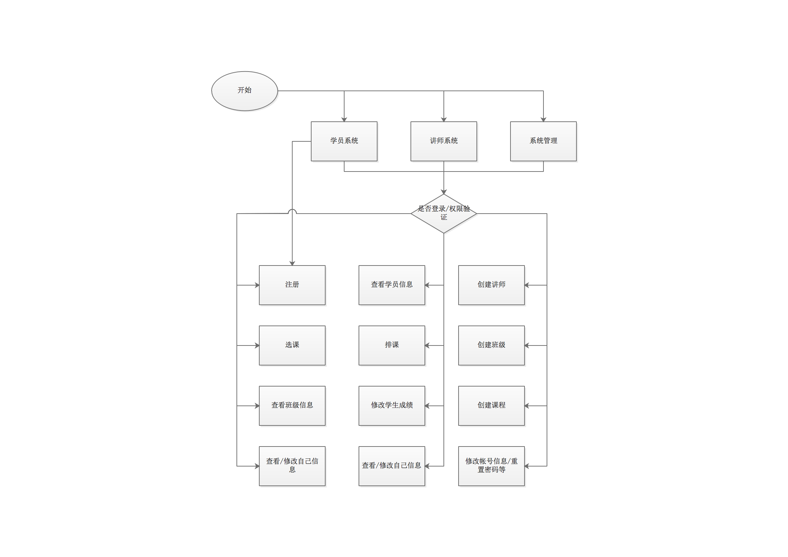

# days6作业-选课系统：

角色:学校、学员、课程、讲师

>作业需求    

- [ ] 1.创建北京、上海 2 所学校
- [ ] 2.创建linux , python , go 3个课程 ， linux\py 在北京开， go 在上海开
- [ ] 3.课程包含，周期，价格，通过学校创建课程 
- [ ] 4.通过学校创建班级， 班级关联课程、讲师
- [ ] 5.创建学员时，选择学校，关联班级
- [ ] 5.创建讲师角色时要关联学校， 
- [ ] 6.提供两个角色接口，一个管理接口   
    6.1学员视图， 可以注册， 交学费， 选择班级    
    6.2讲师视图， 讲师可管理自己的班级， 上课时选择班级， 查看班级学员列表 ， 修改所管理的学员的成绩     
    6.3管理视图，创建讲师， 创建班级，创建课程    
- [ ] 7.上面的操作产生的数据都通过pickle序列化保存到文件里


[ygqygq2的博客地址](http://blog.csdn.net/ygqygq2)

## 1. 程序说明
实现功能如下

- [x] 1.创建北京、上海2所学校
- [x] 2.创建linux,python,go3个课程，linux\py在北京开，go在上海开
- [x] 3.课程包含，周期，价格，通过学校创建课程
- [x] 4.通过学校创建班级，班级关联课程、讲师
- [x] 5.创建学员时，选择学校，关联班级
- [x] 5.创建讲师角色时要关联学校
- [x] 6.提供两个角色接口，一个管理接口
    6.1学员视图，可以注册，交学费，选择班级    
    6.2讲师视图，讲师可管理自己的班级，上课时选择班级，查看班级学员列表，修改所管理的学员的成绩     
    6.3管理视图，创建讲师，创建班级，创建课程    
- [x] 7.上面的操作产生的数据都通过pickle序列化保存到文件里

## 2. 思路和程序限制

首先设置限制：    

    1. 学员有地域限制，不能同时选择北京和上海学校；   
    2. 为避免课程冲突，学员只能选择一个课程，且不考虑历史选课；
    3. 讲师上课时只能选择一个班级；
    4. 讲师周一到周日都可选择班级授课，一日一课程，一周最多7个班级；
    5. 一个帐号只属性一个人，帐户使用用户名登录，对应唯一ID，即学号；
    6. 一个班级可能对应多个讲师；

按帐号区分视图：

    1. 学员帐号
        属性：学号、班级、学校、课程、成绩、名字；
        方法：注册、选课、查看班级信息、修改自己信息；
    2. 导师帐号
        属性：名字、授课班级、学校、授课课程、授课安排；
        方法：查看学员信息、排课、修改自己信息、修改学生成绩；
    3. 系统帐号
        属性：名字、管理员权限
        方法：创建班级、分配学员班级、创建课程、创建讲师、管理员功能

 从程序上来设计：

    1. 人类：属性有名字、年龄、性别；
    2. 城市类：属性有城市名；
    3. 学校类：属性有学校名；
    4. 班级类：属性有班级名，学员，和学员一对多关系；
    5. 学生类：继承基本类人，有其它属性选课、成绩，和班级（一对一）；
    7. 讲师类：继承基本类人，有其它属性教的课程；
    7. 课程类：属性有课程名，价格，；
    8. 帐户类：属性有帐号名、密码、状态、角色；（与人一对一）

简单流程图：


## 3. 选课系统程序目录结构

```
.
├── __init__.py
├── bin  # 可执行程序入口目录
│   ├── __init__.py
│   └── course_selection.py  # 程序入口
├── conf  # 配置文件目录
│   ├── __init__.py
│   ├── __pycache__
│   │   ├── __init__.cpython-35.pyc
│   │   └── settings.cpython-35.pyc
│   └── settings.py  # 配置文件
├── core  # 选课系统主要逻辑程序目录
│   ├── __init__.py
│   ├── __pycache__
│   │   ├── __init__.cpython-35.pyc
│   │   ├── initialization.cpython-35.pyc
│   │   ├── logger.cpython-35.pyc
│   │   ├── main.cpython-35.pyc
│   │   └── operate.cpython-35.pyc
│   ├── logger.py  # 日志记录模块
│   ├── main.py  # 主程序模块
│   └── operate.py  # 系统操作功能模块
├── db  # 数据库目录
│   ├── __init__.py
│   ├── accounts  # 帐户数据库目录
│   │   ├── 10000  # 数据库文件，以学号为唯一id命名文件名
│   │   ├── 10001
│   │   ├── 10002
│   │   ├── __init__.py
│   │   └── user_names  # 学号对应帐户用户名
│   ├── base  # 基础数据库目录
│   │   └── base.db  # 基础数据库
│   └── increment_id  # 记录自增长id最大值
├── lib  # 类目录
│   ├── __init__.py
│   ├── __pycache__
│   │   ├── __init__.cpython-35.pyc
│   │   ├── account.cpython-35.pyc
│   │   ├── banji.cpython-35.pyc
│   │   ├── base.cpython-35.pyc
│   │   ├── course.cpython-35.pyc
│   │   ├── db.cpython-35.pyc
│   │   ├── people.cpython-35.pyc
│   │   └── school.cpython-35.pyc
│   ├── account.py  # 帐户类
│   ├── banji.py  # 班级类
│   ├── base.py  # 基础数据类
│   ├── course.py  # 课程类
│   ├── db.py  # 数据库连接类
│   ├── people.py  # 人、学员、讲师类
│   └── school.py  # 学校类
└── log  # 日志目录
    ├── __init__.py
    └── system.log  # 系统日志

11 directories, 44 files
```

## 4. 测试帐户说明
系统帐户：
admin/admin
讲师帐户：
t1/t1
学员帐户：
s1/s1

## 5. 程序测试过程

```
----------------- 欢迎进入选课系统 -----------------
    1.  学员系统
    2.  讲师系统
    3.  系统管理
    4.  退出
--------------------------------------------------

>>:3

----------------- 欢迎进入管理系统 -----------------
    1.  教务管理
    2.  帐号管理
    3.  后退（注销）
--------------------------------------------------

>>:1

--------------- 欢迎进入教务管理系统 ----------------
--------------------------------------------------
    1.  创建班级
    2.  创建课程
    3.  创建讲师
    4.  班级学员管理
    5.  查看学校
    6.  后退
--------------------------------------------------

>>:1
Please sign in!
Please input user name >>: admin
Please input password >>: admin
Sign in success!

--------------- 欢迎进入教务管理系统 ----------------
--------------------------------------------------
    1.  创建班级
    2.  创建课程
    3.  创建讲师
    4.  班级学员管理
    5.  查看学校
    6.  后退
--------------------------------------------------

>>:1
Please input the class name.
>>: class1
Please input the course name.
>>: java
Please input the name of school which you want to add.eg: [ shanghai_oldboy_school ]
>>: shanghai_oldboy_school
Update school shanghai_oldboy_school success

--------------- 欢迎进入教务管理系统 ----------------
--------------------------------------------------
    1.  创建班级
    2.  创建课程
    3.  创建讲师
    4.  班级学员管理
    5.  查看学校
    6.  后退
--------------------------------------------------

>>:2
Please input the course name.
>>: java
Please input price of zhe course.
>>: 10080
Please input the name of school which you want to add.eg: [ shanghai_oldboy_school ]
>>: shanghai_oldboy_school
Update school shanghai_oldboy_school success

--------------- 欢迎进入教务管理系统 ----------------
--------------------------------------------------
    1.  创建班级
    2.  创建课程
    3.  创建讲师
    4.  班级学员管理
    5.  查看学校
    6.  后退
--------------------------------------------------

>>:3
Input teaching course.
>>: java
Create teacher account!
Please input user name >>: t1
Please input password >>: t1`
Please input password confirmation >>: t1
Passwords do not match!
Account register failed !

--------------- 欢迎进入教务管理系统 ----------------
--------------------------------------------------
    1.  创建班级
    2.  创建课程
    3.  创建讲师
    4.  班级学员管理
    5.  查看学校
    6.  后退
--------------------------------------------------

>>:3
Input teaching course.
>>: java
Create teacher account!
Please input user name >>: t1
Please input password >>: t1
Please input password confirmation >>: t1
Account [10001] register sucessed !
Please input the name of school which you want to add.eg: [ shanghai_oldboy_school ]
>>: shanghai_oldboy_school
Update school shanghai_oldboy_school success

--------------- 欢迎进入教务管理系统 ----------------
--------------------------------------------------
    1.  创建班级
    2.  创建课程
    3.  创建讲师
    4.  班级学员管理
    5.  查看学校
    6.  后退
--------------------------------------------------

>>:5
-------------------- 学校信息 ---------------------
school name：beijing_oldboy_school
courses :
linux
python
teachers :
students :
banjis :
--------------------------------------------------
school name：shanghai_oldboy_school
courses :
go
java
teachers :
李老师
students :
banjis :
class1
--------------------------------------------------

--------------- 欢迎进入教务管理系统 ----------------
--------------------------------------------------
    1.  创建班级
    2.  创建课程
    3.  创建讲师
    4.  班级学员管理
    5.  查看学校
    6.  后退
--------------------------------------------------

>>:6

----------------- 欢迎进入管理系统 -----------------
    1.  教务管理
    2.  帐号管理
    3.  后退（注销）
--------------------------------------------------

>>:3

----------------- 欢迎进入选课系统 -----------------
    1.  学员系统
    2.  讲师系统
    3.  系统管理
    4.  退出
--------------------------------------------------

>>:1

----------------- 欢迎进入学员系统 -----------------
    1.  学员注册
    2.  进入选课
    3.  查看班级
    4.  查看个人信息
    5.  修改个人信息
    6.  后退（注销）
--------------------------------------------------

>>:1
Please input user name >>: s1
Please input password >>: s1
Please input password confirmation >>: s1
Account [10002] register sucessed !

----------------- 欢迎进入学员系统 -----------------
    1.  学员注册
    2.  进入选课
    3.  查看班级
    4.  查看个人信息
    5.  修改个人信息
    6.  后退（注销）
--------------------------------------------------

>>:3
Does not belong to any school!
You did not join any class!

----------------- 欢迎进入学员系统 -----------------
    1.  学员注册
    2.  进入选课
    3.  查看班级
    4.  查看个人信息
    5.  修改个人信息
    6.  后退（注销）
--------------------------------------------------

>>:4
---------------------- 个人信息 ----------------------
account_id: 10002

----------------- 欢迎进入学员系统 -----------------
    1.  学员注册
    2.  进入选课
    3.  查看班级
    4.  查看个人信息
    5.  修改个人信息
    6.  后退（注销）
--------------------------------------------------

>>:5
---------------------- 个人信息 ----------------------
account_id: 10002
Input a dict type data to modify your info.eg: {'age': 28, 'name': 'ygqygq2', 'sex': 'male'}
>>: {'age': 28, 'name': '张三', 'sex': 'male'}

{}
User info modify successed!

----------------- 欢迎进入学员系统 -----------------
    1.  学员注册
    2.  进入选课
    3.  查看班级
    4.  查看个人信息
    5.  修改个人信息
    6.  后退（注销）
--------------------------------------------------

>>:4
---------------------- 个人信息 ----------------------
account_id: 10002
age: 28
name: 张三
sex: male

----------------- 欢迎进入学员系统 -----------------
    1.  学员注册
    2.  进入选课
    3.  查看班级
    4.  查看个人信息
    5.  修改个人信息
    6.  后退（注销）
--------------------------------------------------

>>:2
-------------------- 课程信息 ---------------------
学校名称：beijing_oldboy_school
courses :
linux
python
--------------------------------------------------
学校名称：shanghai_oldboy_school
courses :
go
java
--------------------------------------------------
Please input the course name of you want to learn,eg: [ shanghai_oldboy_school.go ]
>>: shanghai_oldboy_school.java
Select course success

----------------- 欢迎进入学员系统 -----------------
    1.  学员注册
    2.  进入选课
    3.  查看班级
    4.  查看个人信息
    5.  修改个人信息
    6.  后退（注销）
--------------------------------------------------

>>:4
---------------------- 个人信息 ----------------------
account_id: 10002
age: 28
name: 张三
courses: ['java']
sex: male

----------------- 欢迎进入学员系统 -----------------
    1.  学员注册
    2.  进入选课
    3.  查看班级
    4.  查看个人信息
    5.  修改个人信息
    6.  后退（注销）
--------------------------------------------------

>>:3
You did not join any class!

----------------- 欢迎进入学员系统 -----------------
    1.  学员注册
    2.  进入选课
    3.  查看班级
    4.  查看个人信息
    5.  修改个人信息
    6.  后退（注销）
--------------------------------------------------

>>:6

----------------- 欢迎进入选课系统 -----------------
    1.  学员系统
    2.  讲师系统
    3.  系统管理
    4.  退出
--------------------------------------------------

>>:2

----------------- 欢迎进入讲师系统 -----------------
    1.  授课排课
    2.  查看学员信息
    3.  修改学员成绩
    4.  查看个人信息
    5.  修改个人信息
    6.  查看学校
    7.  后退（注销）
--------------------------------------------------

>>:2
Please sign in!
Please input user name >>: t1
Please input password >>: t1
Sign in success!

----------------- 欢迎进入讲师系统 -----------------
    1.  授课排课
    2.  查看学员信息
    3.  修改学员成绩
    4.  查看个人信息
    5.  修改个人信息
    6.  查看学校
    7.  后退（注销）
--------------------------------------------------

>>:4
---------------------- 个人信息 ----------------------
account_id: 10001
teaching: ['java']

----------------- 欢迎进入讲师系统 -----------------
    1.  授课排课
    2.  查看学员信息
    3.  修改学员成绩
    4.  查看个人信息
    5.  修改个人信息
    6.  查看学校
    7.  后退（注销）
--------------------------------------------------

>>:5
---------------------- 个人信息 ----------------------
account_id: 10001
teaching: ['java']
Input a dict type data to modify your info.eg: {'age': 28, 'name': 'ygqygq2', 'sex': 'male'}
>>: {'age': 36, 'name': '李老师', 'sex': 'female'}

{'teaching': ['java']}
User info modify successed!

----------------- 欢迎进入讲师系统 -----------------
    1.  授课排课
    2.  查看学员信息
    3.  修改学员成绩
    4.  查看个人信息
    5.  修改个人信息
    6.  查看学校
    7.  后退（注销）
--------------------------------------------------

>>:4
---------------------- 个人信息 ----------------------
account_id: 10001
age: 36
name: 李老师
sex: female
teaching: ['java']

----------------- 欢迎进入讲师系统 -----------------
    1.  授课排课
    2.  查看学员信息
    3.  修改学员成绩
    4.  查看个人信息
    5.  修改个人信息
    6.  查看学校
    7.  后退（注销）
--------------------------------------------------

>>:2
Please input the class name of you will to see the student.
class_name >>: class1
This class class1 is not what you teaching class!

----------------- 欢迎进入讲师系统 -----------------
    1.  授课排课
    2.  查看学员信息
    3.  修改学员成绩
    4.  查看个人信息
    5.  修改个人信息
    6.  查看学校
    7.  后退（注销）
--------------------------------------------------

>>:6
-------------------- 学校信息 ---------------------
school name：beijing_oldboy_school
courses :
linux
python
teachers :
students :
banjis :
--------------------------------------------------
school name：shanghai_oldboy_school
courses :
go
java
teachers :
李老师
students :
张三
banjis :
class1
--------------------------------------------------

----------------- 欢迎进入讲师系统 -----------------
    1.  授课排课
    2.  查看学员信息
    3.  修改学员成绩
    4.  查看个人信息
    5.  修改个人信息
    6.  查看学校
    7.  后退（注销）
--------------------------------------------------

>>:7

----------------- 欢迎进入选课系统 -----------------
    1.  学员系统
    2.  讲师系统
    3.  系统管理
    4.  退出
--------------------------------------------------

>>:3

----------------- 欢迎进入管理系统 -----------------
    1.  教务管理
    2.  帐号管理
    3.  后退（注销）
--------------------------------------------------

>>:1

--------------- 欢迎进入教务管理系统 ----------------
--------------------------------------------------
    1.  创建班级
    2.  创建课程
    3.  创建讲师
    4.  班级学员管理
    5.  查看学校
    6.  后退
--------------------------------------------------

>>:4
Please sign in!
Please input user name >>: admin
Please input password >>: admin
Sign in success!

--------------- 欢迎进入教务管理系统 ----------------
--------------------------------------------------
    1.  创建班级
    2.  创建课程
    3.  创建讲师
    4.  班级学员管理
    5.  查看学校
    6.  后退
--------------------------------------------------

>>:4
------------------ 没有班级且已选课的学员 -------------------
-------- beijing_oldboy_school --------
可加入学员的班级：
可加入班级的学员：
--------------------------------------------------
------- shanghai_oldboy_school --------
可加入学员的班级：
class_name：class1
course：['java']

可加入班级的学员：
account_id: 10002 name: 张三
--------------------------------------------------
Please send students to join the corresponding class.
eg: shanghai_oldboy_school.class1.10001
>>: shanghai_oldboy_school.class1.10002
Account 10002 join to shanghai_oldboy_school class1 sucessed

--------------- 欢迎进入教务管理系统 ----------------
--------------------------------------------------
    1.  创建班级
    2.  创建课程
    3.  创建讲师
    4.  班级学员管理
    5.  查看学校
    6.  后退
--------------------------------------------------

>>:5
-------------------- 学校信息 ---------------------
school name：beijing_oldboy_school
courses :
linux
python
teachers :
students :
banjis :
--------------------------------------------------
school name：shanghai_oldboy_school
courses :
go
java
teachers :
李老师
students :
张三
banjis :
class1
--------------------------------------------------

--------------- 欢迎进入教务管理系统 ----------------
--------------------------------------------------
    1.  创建班级
    2.  创建课程
    3.  创建讲师
    4.  班级学员管理
    5.  查看学校
    6.  后退
--------------------------------------------------

>>:6

----------------- 欢迎进入管理系统 -----------------
    1.  教务管理
    2.  帐号管理
    3.  后退（注销）
--------------------------------------------------

>>:3

----------------- 欢迎进入选课系统 -----------------
    1.  学员系统
    2.  讲师系统
    3.  系统管理
    4.  退出
--------------------------------------------------

>>:2

----------------- 欢迎进入讲师系统 -----------------
    1.  授课排课
    2.  查看学员信息
    3.  修改学员成绩
    4.  查看个人信息
    5.  修改个人信息
    6.  查看学校
    7.  后退（注销）
--------------------------------------------------

>>:2
Please sign in!
Please input user name >>: t1
Please input password >>: t1
Sign in success!

----------------- 欢迎进入讲师系统 -----------------
    1.  授课排课
    2.  查看学员信息
    3.  修改学员成绩
    4.  查看个人信息
    5.  修改个人信息
    6.  查看学校
    7.  后退（注销）
--------------------------------------------------

>>:2
Please input the class name of you will to see the student.
class_name >>: class1
This class class1 is not what you teaching class!

----------------- 欢迎进入讲师系统 -----------------
    1.  授课排课
    2.  查看学员信息
    3.  修改学员成绩
    4.  查看个人信息
    5.  修改个人信息
    6.  查看学校
    7.  后退（注销）
--------------------------------------------------

>>:1
Please input course scheduling info.【c】to cancel.
format likes 【week: course: class_name】eg: Monday: class1: java, Friday: class1: java
>>: Monday: class1: java, Friday: class1: java
Add ourse scheduling Monday: class1: java successed!
Add ourse scheduling  Friday: class1: java successed!

----------------- 欢迎进入讲师系统 -----------------
    1.  授课排课
    2.  查看学员信息
    3.  修改学员成绩
    4.  查看个人信息
    5.  修改个人信息
    6.  查看学校
    7.  后退（注销）
--------------------------------------------------

>>:1
---------------------- 排课信息 ----------------------
Week      Class: Course
Friday    {'class1': 'java'}
Monday    {'class1': 'java'}
Please input course scheduling info.【c】to cancel.
format likes 【week: course: class_name】eg: Monday: class1: java, Friday: class1: java
>>: c

----------------- 欢迎进入讲师系统 -----------------
    1.  授课排课
    2.  查看学员信息
    3.  修改学员成绩
    4.  查看个人信息
    5.  修改个人信息
    6.  查看学校
    7.  后退（注销）
--------------------------------------------------

>>:2
Please input the class name of you will to see the student.
class_name >>: class1
Please input the account id of you will to see the student.【space】to see all students.
account_id >>:
--------------- 学员[]信息 ----------------
account_id: 10002
age: 28
name: 张三
courses: ['java']
sex: male
banji: class1

----------------- 欢迎进入讲师系统 -----------------
    1.  授课排课
    2.  查看学员信息
    3.  修改学员成绩
    4.  查看个人信息
    5.  修改个人信息
    6.  查看学校
    7.  后退（注销）
--------------------------------------------------
----------------- 欢迎进入讲师系统 -----------------
    1.  授课排课
    2.  查看学员信息
    3.  修改学员成绩
    4.  查看个人信息
    5.  修改个人信息
    6.  查看学校
    7.  后退（注销）
--------------------------------------------------

>>:3
Please input students grades.【c】to cancel.
format likes 【date: class_name: account_id: grade】eg: 2017-04-08: class1: 10001: 80,2017-04-08: class1: 10002: 77
>>: 2017-04-08: class1: 10001: 80
Account 10001 is not in class1!skip add 2017-04-08: class1: 10001: 80

----------------- 欢迎进入讲师系统 -----------------
    1.  授课排课
    2.  查看学员信息
    3.  修改学员成绩
    4.  查看个人信息
    5.  修改个人信息
    6.  查看学校
    7.  后退（注销）
--------------------------------------------------

>>:3
Please input students grades.【c】to cancel.
format likes 【date: class_name: account_id: grade】eg: 2017-04-08: class1: 10001: 80,2017-04-08: class1: 10002: 77
>>: 2017-04-08: class1: 10002: 80
Account 10002 grades modify successed!

----------------- 欢迎进入讲师系统 -----------------
    1.  授课排课
    2.  查看学员信息
    3.  修改学员成绩
    4.  查看个人信息
    5.  修改个人信息
    6.  查看学校
    7.  后退（注销）
--------------------------------------------------

>>:7

----------------- 欢迎进入选课系统 -----------------
    1.  学员系统
    2.  讲师系统
    3.  系统管理
    4.  退出
--------------------------------------------------

>>:4
###################### 谢谢使用 ######################

Process finished with exit code 1
```
